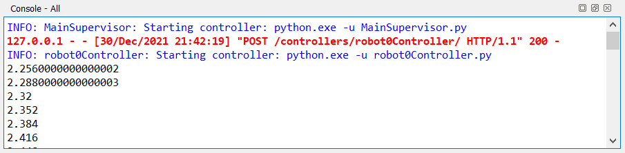

# 2. Uso de la consola

La consola es una herramienta muy útil para mostrar información de la ejecución del programa que a veces no es directamente visible en el simulador.

Podemos usar la consola tanto para mostrar mensajes cuando el programa pasa por un camino de ejecución determinado, como también para  visualizar información relacionada al estado del programa (valores de las variables, valores de los sensores, cálculos intermedios, etc.).

Como se podrán imaginar, todo esto resulta de vital importancia a la hora de depurar nuestros programas (es decir, de diagnosticar y arreglar errores). Por lo tanto, aprender a usar la consola de forma efectiva resulta fundamental para el desarrollo de programas sofisticados.

Además de mostrar los mensajes que define el usuario en su programa controlador, la consola también muestra los errores de compilación y los mensajes provenientes del simulador. De esta forma, si tenemos, por ejemplo, un error de sintaxis en nuestro programa vamos a ver un mensaje de error en la consola indicándonos el problema y usualmente ese mensaje de error es el primer paso hacia una solución del problema.

De forma predeterminada, la consola muestra todos los registros de Webots y las salidas del controlador. Sin embargo, la consola posee un menú contextual que permite al usuario crear un filtro para definir qué registros y salidas del controlador se quieren mostrar (opción “Filter” del menú).


De forma predeterminada, solo hay una consola disponible, pero puede ser útil usar más de una consola (especialmente cuando se filtra lo que se muestra en cada una). Se puede abrir una nueva consola desde el menú “Tools” o desde el menú contextual de una consola ya existente.


## Ejemplo 1 - Cadena de texto

La forma más elemental de mostrar mensajes en la consola es usando la función “print” pasando una cadena de texto como parámetro:

```python
print("Hola mundo")
```


[Descargar ejemplo 1 completo](02_UsoDeConsola/ejemplo_1.py)

## Ejemplo 2 - Flujo de ejecución

Usar cadenas de texto como mensajes en la consola puede parecer poco útil pero en realidad es una forma fácil de analizar el flujo de ejecución del programa, sobre todo cuando no estamos seguros de si una parte del código está ejecutándose correctamente o no. La utilidad de esta técnica se puede apreciar mejor en programas más complejos pero en este ejemplo sencillo se puede ver como algunas partes del código se ejecutan una vez, otras se ejecutan varias veces, y algunas no se ejecutan en ningún momento:

```python
print("Inició la simulación")

while robot.step(TIME_STEP) != -1:
    if True:
        print("Se está ejecutando la simulación")
    else:
        print("Este mensaje NO debería aparecer")

print("Terminó la simulación")
```


[Descargar ejemplo 2 completo](02_UsoDeConsola/ejemplo_2.py)

## Ejemplo 3 - Variables

Probablemente la forma más común de usar la consola sea para mostrar el valor de alguna variable (o varias). En este caso, en lugar de pasar una cadena de texto como parámetro de la función “print” lo que pasamos es directamente el valor que queremos mostrar en la consola. 

En el ejemplo siguiente se observa cómo mostrar en la consola los segundos desde que inició la simulación:

```python
print(robot.getTime()) # Muestro los segundos actuales en la consola
```



[Descargar ejemplo 3 completo](02_UsoDeConsola/ejemplo_3.py)

## Ejemplo 4 - "Formatted string"

Cuando empezamos a mostrar múltiples valores en la consola resulta fácil confundir el significado de cada valor. Resulta entonces muy útil combinar una cadena de texto con el valor que queremos mostrar de forma que podamos identificar qué significa cada valor:

```python
c = 0 # Usamos esta variable para contar los ciclos de simulación

while robot.step(TIME_STEP) != -1:
    c = c + 1 # En cada ciclo, incrementamos el contador en 1
    print(f"Cantidad de ciclos: {c}")
    print(f"Segundos de simulación: {robot.getTime()}")
```


[Descargar ejemplo 4 completo](02_UsoDeConsola/ejemplo_4.py)

## Ejemplo 5 - Condiciones

Puede resultar útil mostrar un mensaje en la consola dependiendo de si se cumple o no una condición. El siguiente ejemplo muestra en la consola un mensaje cada 10 segundos:

```python
t0 = robot.getTime() # Guardamos los segundos al iniciar el programa

while robot.step(TIME_STEP) != -1:
    # Chequeamos si pasaron 10 segundos.
    if robot.getTime() - t0 > 10:
        print("A") # Ya pasaron 10 segundos
        t0 = robot.getTime() # Vuelvo a iniciar el contador
```


[Descargar ejemplo 5 completo](02_UsoDeConsola/ejemplo_5.py)