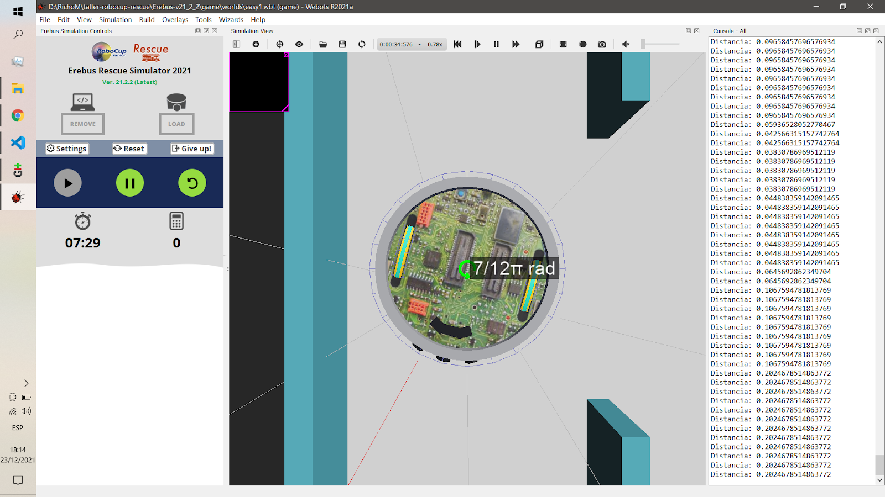
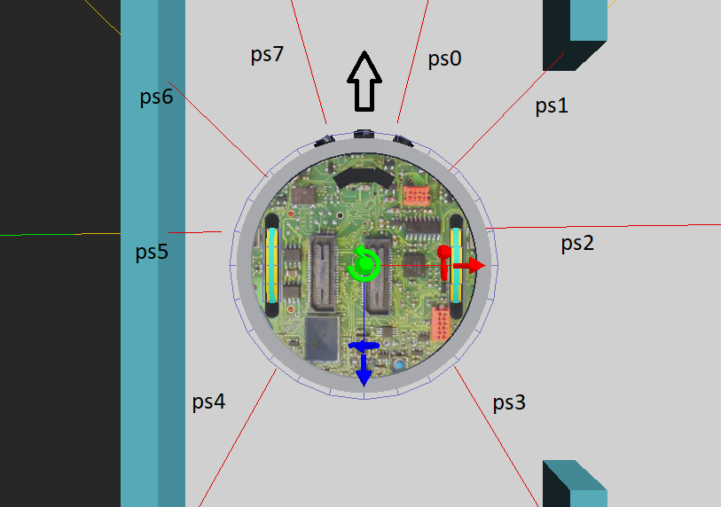
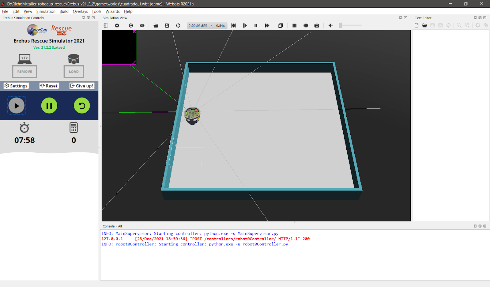
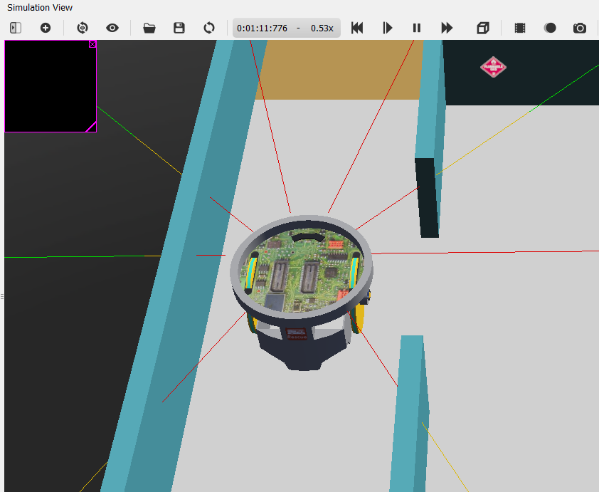
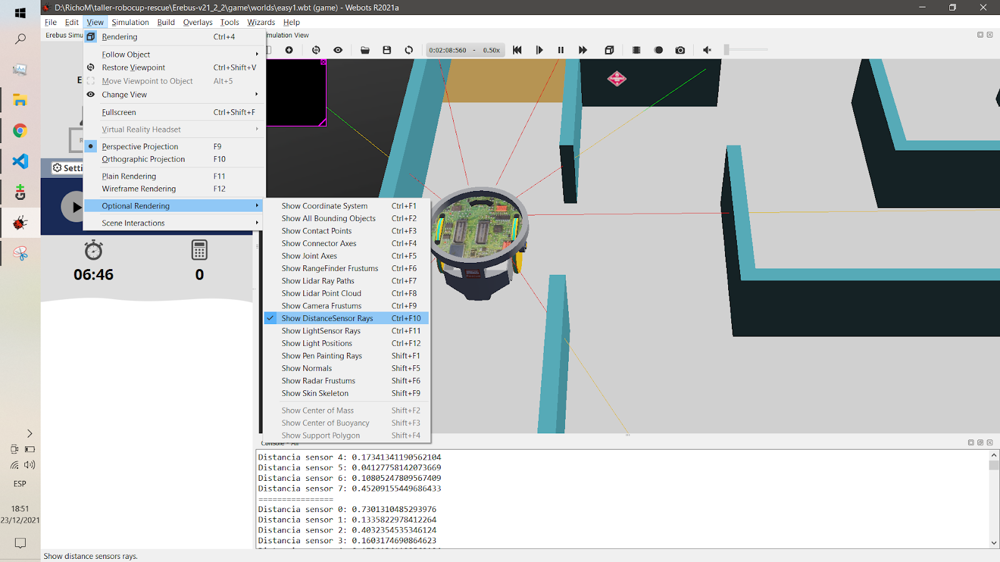

# 4. Sensores de distancia

Los sensores infrarrojos del robot sirven para medir la distancia al primer objeto en la línea de visión del sensor. Están configurados para funcionar en el rango entre 0 y 0,8 metros.

Para acceder los sensores de distancia se deben seguir 3 pasos:
1. Obtener el sensor ejecutando el método “robot.getDevice” y pasando como parámetro el nombre del dispositivo (por defecto: “ps0” a “ps7”)
2. Habilitar el sensor usando el método “enable” y pasando como parámetro la frecuencia de actualización del sensor (este valor usualmente es igual al TIME_STEP configurado anteriormente)
3. Finalmente, obtener los valores del sensor usando el método “getValue”

## Ejemplo 1 - Activando el sensor

En el siguiente ejemplo se pueden ver los 3 pasos necesarios para obtener el valor del sensor “ps0” y mostrarlo en la consola.

```python
from controller import Robot

TIME_STEP = 32

robot = Robot()

ps0 = robot.getDevice("ps0") # Paso 1
ps0.enable(TIME_STEP) # Paso 2

while robot.step(TIME_STEP) != -1:
    dist = ps0.getValue() # Paso 3
    print(f"Distancia: {dist}")
```

Si bien este programa no mueve el robot podemos moverlo manualmente usando los controles de webots y así observar cómo los valores registrados por el sensor van cambiando a medida que lo acercamos o alejamos de la pared.



En el robot por defecto los sensores de distancia están distribuidos alrededor del robot en posiciones predeterminadas.



Tenemos que tener en cuenta la ubicación de cada sensor para decidir cuáles habilitar e incluso, dependiendo de la estrategia elegida, podría ser útil modificar la ubicación de los sensores para tener información más precisa.

[Descargar ejemplo 1 completo](04_Distancia/ejemplo_1.py)

## Ejemplo 2 - Avanzar hasta pared

Los sensores de distancia son muy útiles para detectar la cercanía del robot con las paredes u obstáculos, lo cual nos va a permitir comenzar a diseñar un sistema de navegación que tenga en cuenta el entorno del robot.

Podemos implementar muy fácilmente, por ejemplo, un robot que avance hasta detectar la cercanía de un obstáculo y luego se detenga. Habilitamos en este caso “ps0” y “ps7”, que son los dos sensores delanteros, de forma que podamos detectar cuando el robot se aproxime a la pared. Luego, en cada ciclo de la simulación chequeamos el valor de ambos sensores y si alguno devuelve un valor menor a 0,06 entonces detenemos ambos motores, de lo contrario avanzamos.

```python
ps7 = robot.getDevice("ps7")
ps7.enable(TIME_STEP)

ps0 = robot.getDevice("ps0")
ps0.enable(TIME_STEP)

while robot.step(TIME_STEP) != -1:
    # Si detectamos una pared, nos detenemos
    if ps7.getValue() < 0.06 or ps0.getValue() < 0.06:
        wheelL.setVelocity(0)
        wheelR.setVelocity(0)
    else:
        wheelL.setVelocity(MAX_VEL)
        wheelR.setVelocity(MAX_VEL)
```

[Descargar ejemplo 2 completo](04_Distancia/ejemplo_2.py)

## Ejemplo 3 - Mantener distancia

Los sensores de distancia pueden servir para programar comportamientos más interesantes. En el siguiente ejemplo podemos observar un robot que (con cierta torpeza) se mueve manteniendo la distancia con la pared izquierda. 

> NOTA: Recomendamos para este ejemplo utilizar los mundos [mapa_cuadrado_1.wbt](04_Distancia/mapa_cuadrado_1.wbt) y [mapa_cuadrado_2.wbt](04_Distancia/mapa_cuadrado_2.wbt)



En este caso, los sensores que nos interesan son “ps6” y “ps5”, dado que ambos están a la izquierda del robot. Lo que hace el programa es simplemente registrar en una variable llamada “delta0” la diferencia entre los dos sensores en el primer ciclo de la simulación y luego, en los ciclos siguientes, intenta corregir el movimiento del robot de forma que la diferencia entre ambos sensores se mantenga en valores cercanos a la medición inicial. Para ello, simplemente sustrae “delta0” a la diferencia actual y usa el valor resultante para decidir hacia dónde debe moverse el robot: si el valor es positivo significa que el robot se alejó demasiado de la pared, y si es negativo significa que está demasiado cerca.

```python
delta0 = None # Declaramos la variable delta0

while robot.step(TIME_STEP) != -1:
    if delta0 == None: # Sólo en el primer ciclo, inicializamos delta0
        delta0 = ps6.getValue() - ps5.getValue()
    
    # Calculamos la diferencia con la medición inicial
    giro = (ps6.getValue() - ps5.getValue()) - delta0
    
    # Avanzamos dependiendo del signo de "giro"
    # giro positivo = izquierda
    # giro negativo = derecha
    if giro > 0:
        wheelL.setVelocity(0.5*MAX_VEL)
        wheelR.setVelocity(1.0*MAX_VEL)
    else:
        wheelL.setVelocity(1.0*MAX_VEL)
        wheelR.setVelocity(0.5*MAX_VEL)

    # Si nos acercamos mucho a la pared, giramos rápidamente
    if ps6.getValue() < 0.06:
        wheelL.setVelocity(1.0*MAX_VEL)
        wheelR.setVelocity(-1.0*MAX_VEL)
```

[Descargar ejemplo 3 completo](04_Distancia/ejemplo_3.py)

## Ejemplo 4 - Activando todos los sensores

Es muy probable que en el controlador final necesitemos usar todos los sensores de distancia que posee el robot. En ese caso, la opción más conveniente para escribir la menor cantidad de código es guardarlos en una lista en lugar de usar variables individuales. Luego, cuando queremos chequear el valor de un sensor simplemente tenemos que buscarlo por su índice en la lista. De esta forma, el sensor ps0 se encontraría en el índice 0 y el ps7 en el índice 7.

```python
distSensors = []
for i in range(8):
    sensor = robot.getDevice("ps" + str(i))
    sensor.enable(TIME_STEP)
    distSensors.append(sensor)

while robot.step(TIME_STEP) != -1:
    for i in range(8):
        print(f"Distancia sensor {i}: {distSensors[i].getValue()}")
    print("================")
```

Puede ser útil en algunos casos visualizar los rayos proyectados por cada sensor en el mapa como se puede vera continuación.



Para habilitar esta visualización debemos hacer click en el menú de webots “View” → “Optional Rendering” y habilitar la opción “Show DistanceSensor Rays”



[Descargar ejemplo 4 completo](04_Distancia/ejemplo_4.py)

---
## Ejercicios

Para cada ejercicio se pide armar un programa controlador distinto y entregar los archivos de código.

1. Leer el valor de uno de los sensores de distancia e imprimirlo por consola.
2. Activar más de un sensor de distancia e imprimir sus valores por consola.
3. Avanzar hasta encontrar una pared y frenar. Usar [mapa_pasillo.wbt](04_Distancia/mapa_pasillo.wbt)
4. Girar hasta detectar el hueco alrededor del robot. Usar [mapa_salida.wbt](04_Distancia/mapa_salida.wbt)
