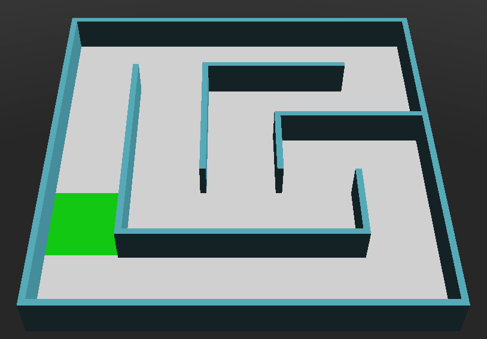
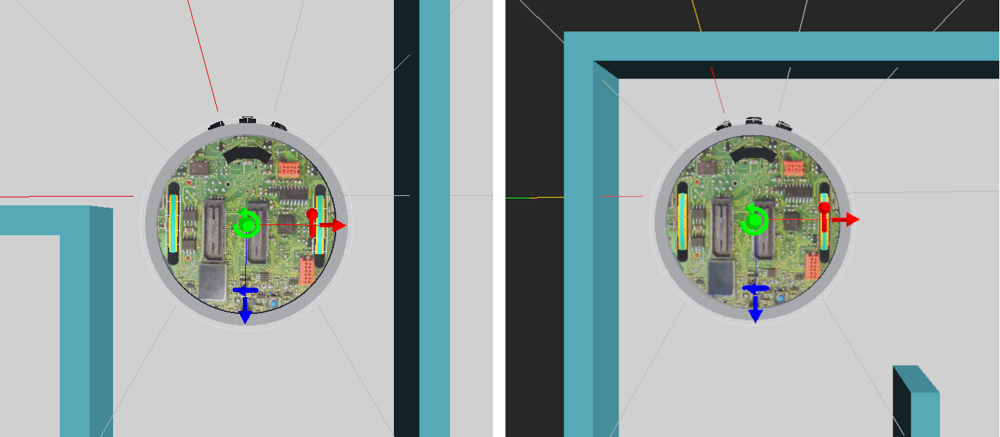

# Recorriendo un mapa básico sin agujeros

La estrategia más conocida para recorrer un laberinto es aquella que nos indica que debemos mantener siempre una de nuestras manos (ya sea la izquierda o la derecha) pegada a la pared. Esta estrategia es conocida como el algoritmo “[wall follower](https://en.wikipedia.org/wiki/Maze-solving_algorithm#Wall_follower)” (o método de la mano izquierda/derecha), y es muy fácil de implementar.

Podemos aplicar esta estrategia en nuestro robot aprovechando los [sensores de distancia](04_Distancia.md) para mantener al robot siempre “pegado” (a una distancia prudente) a alguna de las paredes.

En este ejemplo usaremos 2 [sensores de distancia](04_Distancia.md): ps5 y ps7. Por un lado, necesitamos detectar la pared izquierda para poder mantener la distancia, para eso usaremos el sensor ps5. Necesitamos también detectar las paredes al frente del robot (para evitar chocar), para eso usaremos el sensor ps7.


Recomendamos, para este ejemplo, usar el mundo “[mapa_noholes_1.wbt](05_Mapa/mapa_noholes_1.wbt)” ya que este mapa está armado de tal forma que no contenga agujeros ni trampas y además permite observar el comportamiento del robot ante diferentes tipos de giros.



Lo primero que hacemos entonces es inicializar el robot y sus dispositivos (los dos motores y dos sensores).

```python
robot = Robot()

wheelL = robot.getDevice("wheel1 motor")
wheelL.setPosition(float("inf"))

wheelR = robot.getDevice("wheel2 motor")
wheelR.setPosition(float("inf"))

ps7 = robot.getDevice("ps7")
ps7.enable(TIME_STEP)

ps5 = robot.getDevice("ps5")
ps5.enable(TIME_STEP)
```

Vamos a introducir en este ejemplo una función “delay” que resultará muy útil para esperar un tiempo determinado sin detener la ejecución de la simulación. Esta función ejecuta el “robot.step” en un loop hasta que haya transcurrido el tiempo deseado. De esta forma, el controlador del robot no realiza ninguna acción mientras se ejecuta el loop pero la simulación no se detiene.

```python
def delay(ms):
    initTime = robot.getTime()
    while robot.step(TIME_STEP) != -1:
        if (robot.getTime() - initTime) * 1000.0 >= ms:
            break
```

Aprovechando la función “delay” vamos a implementar dos funciones que nos permitan girar a la derecha y a la izquierda, respectivamente. Estas funciones establecen la velocidad de las ruedas y luego esperan un tiempo determinado para que el giro que realice el robot tenga la forma deseada. Una vez realizado el giro, frenamos los motores antes de continuar con la ejecución.

```python
def turnRight():
    wheelL.setVelocity(MAX_VEL)
    wheelR.setVelocity(-MAX_VEL)
    delay(350)
    wheelL.setVelocity(0)
    wheelR.setVelocity(0)
    delay(1)

def turnLeft():
    wheelL.setVelocity(0.30*MAX_VEL)
    wheelR.setVelocity(1.00*MAX_VEL)
    delay(350)
    wheelL.setVelocity(0)
    wheelR.setVelocity(0)
    delay(1)
```

Dentro del loop principal vamos a realizar tres acciones. Primero, capturamos los valores de los sensores y los guardamos en variables para poder acceder a los mismos fácilmente. Estos valores representan la distancia hasta la pared izquierda y la distancia hacia la pared frontal.

```python
# Leo los sensores de distancia y guardo los valores en variables
dist_left = ps5.getValue()
dist_front = ps7.getValue()
```

Luego, en función de la distancia a la pared izquierda ajustamos la velocidad de las ruedas. El objetivo es avanzar lo más recto posible, pero si detectamos la cercanía con la pared entonces reducimos ligeramente la velocidad de la rueda derecha de forma que el robot se aleje lentamente de la pared. De forma similar, si detectamos que nos estamos alejando demasiado de la pared, reducimos la velocidad de la rueda izquierda. Por último, si la distancia hasta la pared se mantiene dentro del umbral arbitrario entre 0,035 m y 0,045 m hacemos avanzar ambas ruedas a la máxima velocidad.

```python
# Ajustamos la velocidad de las ruedas dependiendo de la distancia
# con la pared izquierda. Si nos acercamos mucho giramos ligeramente
# a la derecha. Si nos alejamos giramos ligeramente a la izquierda.
# El objetivo es mantenernos en un rango entre 0.035 y 0.045
if dist_left < 0.035:
    wheelL.setVelocity(1.0 * MAX_VEL)
    wheelR.setVelocity(.95 * MAX_VEL)
elif dist_left > 0.045:
    wheelL.setVelocity(.95 * MAX_VEL)
    wheelR.setVelocity(1.0 * MAX_VEL)
else:
    wheelL.setVelocity(1.0 * MAX_VEL)
    wheelR.setVelocity(1.0 * MAX_VEL)
```

El paso final de la estrategia es reaccionar correctamente a los cruces y giros que presente el mapa. En particular nos interesa responder a dos tipos de situaciones: un giro a la izquierda y un giro obligado a la derecha.

Como podemos observar en la siguiente imagen, el giro a la izquierda es fácilmente reconocible con sólo mirar el sensor ps5. Si el sensor no detecta la presencia de una pared, independiente del valor del sensor ps7, podemos saber con seguridad que se aproxima un giro a la izquierda. Por el contrario, para detectar el giro a la derecha necesitamos que ambos sensores indiquen la presencia de una pared. 



```python
# Si la distancia a la pared izquierda supera los 0.1 metros
# significa que tenemos que girar 90 grados hacia la izquierda.
# Si en cambio nos encontramos con una pared adelante, tenemos
# que girar 90 grados a la derecha.
if dist_left > 0.1:
    turnLeft()
elif dist_front < 0.05:
    turnRight()
```

Un problema con esta estrategia es que, dependiendo de la estructura del laberinto puede haber partes del mismo que nos queden sin explorar. Por ejemplo, la zona marcada en amarillo en la siguiente figura. Recordemos que el objetivo del robot no es encontrar la salida del laberinto sino explorarlo en su totalidad.


¿Cómo podemos modificar la estrategia para que el robot pueda explorar todo el mapa?

[Descargar ejemplo completo](05_Mapa/ejemplo_1.py)