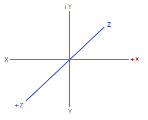
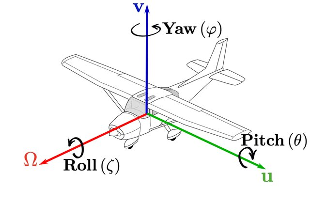

# 1. Posicionamiento del robot

El robot cuenta con 4 sensores que podemos utilizar para estimar su posición y orientación en el mapa:

1. El acelerómetro
2. El giroscopio
3. La unidad de medición inercial
4. El GPS

El acelerómetro y el giroscopio nos brindan información relativa al movimiento del robot (en particular, aceleración y velocidad angular), la unidad de medición inercial nos entregan información acerca de la orientación del robot, y el GPS nos permite obtener la posición absoluta del robot mediante coordenadas en los 3 ejes (X, Y, Z).



En este tutorial vamos a aprender a controlar estos 3 sensores para hacernos una idea precisa de la posición y orientación del robot, de forma que podamos utilizar luego esta información para mejorar la exploración del mapa.

## Ejemplo 1 - Acelerómetro

El acelerómetro nos permite obtener el valor de aceleración del robot (variación de velocidad en unidad de tiempo) en los 3 ejes del robot (X, Y, Z).

Como con todos los componentes del robot, tenemos que seguir los 3 pasos clásicos para utilizar el sensor, con una sola diferencia: dado que el acelerómetro devuelve 3 valores en lugar de sólo 1, debemos ejecutar el método “getValues” (nótese el plural) en lugar de “getValue”.

1. Obtener el objeto que representa al sensor mediante el mensaje “robot.getDevice”. El nombre del sensor en el robot por defecto es “accelerometer”.
2. Habilitar el sensor enviando el mensaje “enable” pasando como parámetro el TIME_STEP de la simulación.
3. Acceder a los valores del sensor mediante el mensaje “getValues”.

En este ejemplo lo que vamos a hacer es introducir una nueva función “updateVars()”, encargada de actualizar las variables que consideremos importantes para la lógica del controlador. En particular, para este caso sólo la usaremos para obtener la información de la aceleración y mostrarla en la consola.

```python
# Creamos el objeto accelerometer y lo habilitamos
accel = robot.getDevice("accelerometer")
accel.enable(TIME_STEP)

# En esta variable vamos a guardar los valores que obtenemos del sensor
acceleration = [0, 0, 0]

def updateVars():
    global acceleration
    acceleration = accel.getValues()
    x, y, z = acceleration
    print(f"X: {x:.3f} m/s^2")    
    print(f"Y: {y:.3f} m/s^2")
    print(f"Z: {z:.3f} m/s^2")
    print("================")
```

Dado que el valor de los sensores cambian conforme avanza la simulación es importante llamar a “updateVars()” luego de cada “robot.step()”, de esta forma podemos estar seguros que la variable “acceleration” tiene siempre la información actualizada. En nuestro ejemplo, tenemos una llamada a “robot.step()” en el loop principal y otra llamada en la función “delay”.

```python
def delay(ms):
    initTime = robot.getTime()
    while robot.step(TIME_STEP) != -1:
        updateVars() # Llamamos a updateVars() luego de robot.step()
        if (robot.getTime() - initTime) * 1000.0 > ms:
            break

while robot.step(TIME_STEP) != -1:
    updateVars() # Llamamos a updateVars() luego de robot.step()
```

Finalmente, para poder observar la aceleración del robot tenemos que moverlo:

```python
    wheelL.setVelocity(0.25*MAX_VEL)
    wheelR.setVelocity(0.25*MAX_VEL)
    delay(500)

    wheelL.setVelocity(0)
    wheelR.setVelocity(0)
    delay(500)

    wheelL.setVelocity(1.0*MAX_VEL)
    wheelR.setVelocity(1.0*MAX_VEL)
    delay(500)

    wheelL.setVelocity(0)
    wheelR.setVelocity(0)
    delay(500)
```

[Descargar ejemplo 1 completo](01_Posicionamiento/ejemplo_1_accelerometer.py)

## Ejemplo 2 - Giroscopio

El giroscopio nos permite obtener la velocidad angular del robot. Así como con el acelerómetro, debemos seguir los 3 pasos habituales:

1. Obtener el objeto que representa al giroscopio mediante el mensaje “robot.getDevice”. El nombre del sensor en el robot por defecto es “gyro”.
2. Habilitar el sensor enviando el mensaje “enable” pasando como parámetro el TIME_STEP de la simulación.
Acceder a los valores del sensor mediante el mensaje “getValues”
3. Si bien el sensor nos devuelve la información de la velocidad angular para los 3 ejes de rotación del robot (X, Y, Z) el eje que nos resulta más útil es el eje vertical (cualquier rotación en otro sentido implicaría que el robot está tumbado).

Del mismo modo que con el acelerómetro, el giroscopio devuelve los valores para cada sensor en una tupla de 3 elementos. Sin embargo, dependiendo de la orientación del sensor en el robot utilizado, el valor que nos interesa puede estar ubicado en cualquier posición de la tupla. Podemos verificar esto muy rápidamente haciendo un controlador que gire el robot sobre sí mismo y observando cuál de los 3 valores del sensor cambia. En el caso del robot por defecto, se verifica que el valor que nos interesa se ubica en el índice 1 de la tupla.

El valor de velocidad angular que devuelve el giroscopio está representado en radianes por segundo y, mediante un [cálculo muy sencillo](https://www.texasgateway.org/resource/61-angle-rotation-and-angular-velocity), podemos transformar este valor en una estimación de la orientación actual del robot (lo cual nos será muy útil para mejorar la navegación).

Como siempre, comenzamos por habilitar el giroscopio:

```python
# Inicializamos el giroscopio
gyro = robot.getDevice("gyro")
gyro.enable(TIME_STEP)
```

Así como hicimos con el acelerómetro, vamos a declarar un conjunto de variables globales que nos servirán para almacenar el valor de la orientación del robot. En este caso, para realizar el cálculo necesitaremos saber también el tiempo que pasó entre cada medición del sensor (es decir, entre cada ciclo de la simulación), por lo tanto también utilizaremos variables para guardar esa información.

```python
# Esta variable va a tener la orientación del robot (en radianes).
rotation = 0

# Necesitamos algunas variables más para llevar la cuenta del tiempo de la 
# simulación, y cuánto tiempo pasó desde el último ciclo
beginTime = robot.getTime()
currentTime = beginTime
deltaTime = 0
```

A continuación, modificaremos la función “updateVars()” para calcular cuánto giró el robot desde el último ciclo y sumarlo a la variable “rotation”.

```python
# La función updateVars() se encarga de actualizar las variables globales 
# de acuerdo a los valores de los sensores. 
# IMPORTANTE: Hay que llamarla después de cada robot.step()
def updateVars():
    global currentTime, deltaTime, rotation
    # Primero calculamos cuánto tiempo pasó desde el último ciclo
    lastTime = currentTime
    currentTime = robot.getTime()
    deltaTime = currentTime - lastTime
    
    # Luego calculamos la rotación del robot:
    # 1) Obtenemos primero la velocidad angular
    _, vel, _ = gyro.getValues()
    # 2) Calculamos luego la rotación en el último ciclo y la sumamos a la 
    # variable rotation
    rotation += (vel * deltaTime)
    # 3) Normalizamos el valor de rotation para que se mantenga siempre entre
    # 0 y 360 grados (o el equivalente en radianes: 0 y 2*PI)
    rotation %= math.tau # Normalizamos el valor del ángulo
    
    # OPCIONAL: Calcular el valor de rotación en grados y mostrarlo en consola
    degrees = rotation * 180/math.pi
    print(f"Velocidad: {vel:.3f} rad/s")
    print(f"Rotación: {rotation:.3f} rad ({degrees:.3f} deg)")
    print("================")
```

Es importante llamar a la función “updateVars” luego de cada “paso” de la simulación, por eso en este ejemplo decidimos encapsular el llamado a la función “robot.step()” en una función “step” propia que llame a “updateVars” automáticamente. Así nos aseguramos que los valores de las variables estén siempre actualizadas y no perdamos precisión en el cálculo de la orientación.

```python
# Encapsulamos la llamada a robot.step() en una función step() propia que llama 
# automáticamente a updateVars(). De esta forma evitamos llamar a updateVars() 
# manualmente porque step() lo hace por nosotros.
def step():
    result = robot.step(TIME_STEP)
    updateVars()
    return result
```

Ahora que tenemos nuestra propia función “step” es necesario reemplazar en el código en todos los lugares donde llamábamos a “robot.step” por una llamada a nuestra función. En este caso, los únicos dos lugares son la función “delay” y el loop principal.

```python
# Tenemos que actualizar delay() para que llame a nuestra función step() en
# lugar de robot.step()
def delay(ms):
    initTime = robot.getTime()
    while step() != -1:
        if (robot.getTime() - initTime) * 1000.0 > ms:
            break

# En lugar de llamar a robot.step() llamamos a nuestra función step()
while step() != -1:
    wheelL.setVelocity(-0.25*MAX_VEL)
    wheelR.setVelocity(0.25*MAX_VEL)
    delay(500)
    wheelL.setVelocity(0)
    wheelR.setVelocity(0)
    delay(500)
```

Finalmente, en el loop principal hacemos girar al robot para verificar que el cálculo de la orientación es correcto.

[Descargar ejemplo 2 completo](01_Posicionamiento/ejemplo_2_gyro.py)

## Ejemplo 3 - Unidad de medición inercial (Inertial Unit o IMU)

La unidad de medición inercial ("inertial unit" en inglés) es un dispositivo electrónico que funciona detectando la actual tasa de aceleración usando uno o más acelerómetros, y detecta los cambios en atributos rotacionales tales como cabeceo ("pitch"), alabeo ("roll") y guiñada ("yaw") usando uno o más giróscopos.



En nuestro caso, podemos utilizar el inertial unit en lugar del giroscopio para obtener la rotación del robot.

> IMPORTANTE: Desafortunadamente, el robot por defecto no incluye un inertial unit, por lo cual en este ejemplo usaremos el siguiente robot personalizado: [robot_inertial_unit.json](01_Posicionamiento/robot_inertial_unit.json)

Los pasos para utilizar el inertial unit son los siguientes:

1. Obtener el objeto que representa al inertial unit mediante el mensaje “robot.getDevice”. El nombre del sensor en el [robot_inertial_unit.json](01_Posicionamiento/robot_inertial_unit.json) es “inertial_unit”.
2. Habilitar el sensor enviando el mensaje “enable” pasando como parámetro el TIME_STEP de la simulación.
3. Acceder a los valores del inertial unit mediante el mensaje "getRollPitchYaw".

```python
# Inicializamos la unidad de medición inercial
inertialUnit = robot.getDevice("inertial_unit")
inertialUnit.enable(TIME_STEP)
```

Así como en los ejemplos anteriores, utilizaremos la función "updateVars" para obtener los valores de los sensores y actualizar una variable global que represente la orientación del robot.

```python
# Esta variable va a tener la orientación del robot (en radianes)
rotation = None

# La función updateVars() se encarga de actualizar las variables globales 
# de acuerdo a los valores de los sensores. 
# IMPORTANTE: Hay que llamarla después de cada robot.step()
def updateVars():
    global rotation
    
    # 1) Obtenemos la rotación del robot en los tres ejes
    roll, pitch, yaw = inertialUnit.getRollPitchYaw()    
    print(f"Roll: {roll:.3f}, Pitch: {pitch:.3f}, Yaw: {yaw:.3f}")

    # 2) El eje que nos interesa para la rotación del robot es el yaw
    rotation = yaw

    # 3) Normalizamos el valor de rotation para que se mantenga siempre entre
    # 0 y 360 grados (o el equivalente en radianes: 0 y 2*PI)
    rotation %= math.tau # Normalizamos el valor del ángulo

    # OPCIONAL: Calcular el valor de rotación en grados y mostrarlo en consola
    degrees = rotation * 180/math.pi
    print(f"Rotación: {rotation:.3f} rad ({degrees:.3f} deg)")
    print("================")
```

Para asegurarnos de tener siempre la variable actualizada definiremos una función "step" que ejecute "updateVars" automáticamente luego de llamar a "robot.step".

```python
# Encapsulamos la llamada a robot.step() en una función step() propia que llama 
# automáticamente a updateVars(). De esta forma evitamos llamar a updateVars() 
# manualmente porque step() lo hace por nosotros.
def step():
    result = robot.step(TIME_STEP)
    updateVars()
    return result
```

Por supuesto, también tenemos que asegurarnos de llamar a "step" en lugar de "robot.step" en el resto del programa. Particularmente en la función "delay" y en el loop principal.

```python
# Tenemos que actualizar delay() para que llame a nuestra función step() en
# lugar de robot.step()
def delay(ms):
    initTime = robot.getTime()
    while step() != -1:
        if (robot.getTime() - initTime) * 1000.0 > ms:
            break

# En lugar de llamar a robot.step() llamamos a nuestra función step()
while step() != -1:
    wheelL.setVelocity(-0.25*MAX_VEL)
    wheelR.setVelocity(0.25*MAX_VEL)
    delay(500)
    wheelL.setVelocity(0)
    wheelR.setVelocity(0)
    delay(500)
```

[Descargar ejemplo 3 completo](01_Posicionamiento/ejemplo_3_inertialunit.py)


## Ejemplo 4 - GPS

El GPS nos permite obtener la posición absoluta del robot en el mundo. Como tal, este sensor resulta de vital importancia a la hora de la exploración del mapa ya que nos permite ir registrando, mientras el robot se mueve, qué baldosas fueron visitadas y qué características pudo obtener el robot acerca de las mismas. Como veremos más adelante, poder hacer esto de forma precisa es fundamental tanto para el trazado del mapa como para desarrollar estrategias de exploración más sofisticadas.

Para usar el GPS tenemos que seguir los 3 pasos habituales:

1. Obtener el objeto que representa al GPS mediante el mensaje “robot.getDevice”. El nombre del sensor en el robot por defecto es “gps”.
2. Habilitar el sensor enviando el mensaje “enable” pasando como parámetro el TIME_STEP de la simulación.
3. Acceder a los valores del GPS mediante el mensaje “getValues”.

```python
gps = robot.getDevice("gps") # Paso 1: Obtener el sensor
gps.enable(TIME_STEP) # Paso 2: Habilitar el sensor

while robot.step(TIME_STEP) != -1:
    # Paso 3: Usar el método getValues() para obtener la posición del robot (x, y, z)
    x, y, z = gps.getValues()
    
    print(f"X: {x:.3f}, Y: {y:.3f}, Z: {z:.3f}")
```

[Descargar ejemplo 4 completo](01_Posicionamiento/ejemplo_4_gps.py)

---
## Ejercicios

Para cada ejercicio se pide armar un programa controlador distinto y entregar los archivos de código.

1. Programar una función "girar" que reciba el ángulo a girar y use el valor del inertial unit para decidir cuándo detenerse (tratar de que el movimiento sea lo más preciso y rápido posible)
2. Programar una función "avanzar" que reciba la distancia a recorrer y use el valor del GPS para calcular cuándo detenerse (tratar de que el movimiento sea lo más preciso y rápido posible)
3. Usar las nuevas funciones de movimiento para mejorar el algoritmo de navegación desarrollado en la unidad anterior (girar de forma precisa y moverse de centro de baldosa a centro de baldosa)