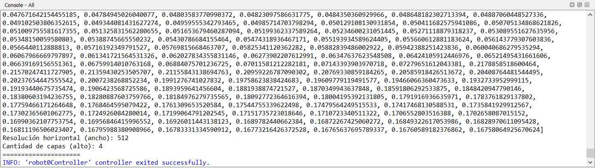
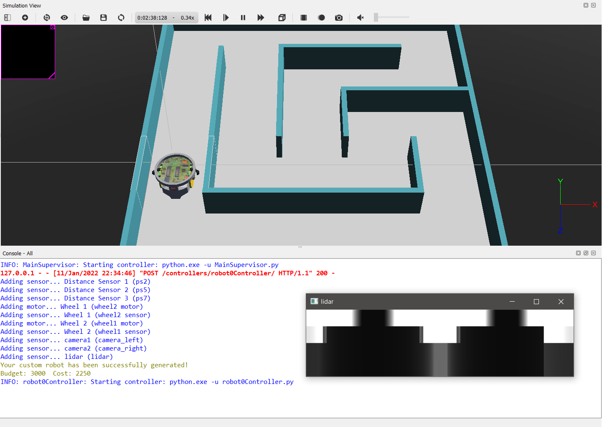
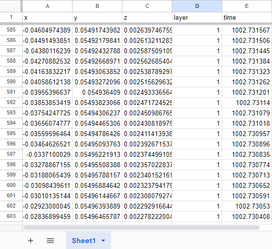

# 3. Uso del LIDAR

El LIDAR es un sensor avanzado que nos permite obtener una representación casi tridimensional de los objetos que rodean al robot. Funciona emitiendo un láser alrededor del robot y calculando la distancia desde el emisor hasta la primera obstrucción del láser.

Para usar el LIDAR debemos armar un robot personalizado y agregar el sensor, ya que no viene incluido en el robot por defecto. Es un sensor que nos brinda mucha información con un alto grado de precisión, por lo tanto, es muy costoso de agregar al robot. Y también es costoso en términos de performance en la ejecución. Por lo tanto, si decidimos incluirlo en nuestro robot debemos integrarlo muy bien en nuestra estrategia.

En todos los ejemplos siguientes vamos a utilizar un robot por defecto que pueden descargar en el siguiente link: [robot_lidar.json](03_LIDAR/robot_lidar.json)

Si se desea armar un robot personalizado debemos utilizar la [herramienta de personalización de robots](https://v24.robot.erebus.rcj.cloud/). 

> IMPORTANTE: La posición por defecto en la que la herramienta de personalización ubica el sensor es en el centro del robot. Deberemos, por lo tanto, modificar la ubicación y orientación del LIDAR para que pueda detectar los objetos que lo rodean. De lo contrario, la información obtenida no tendrá ninguna utilidad.

Para usar el LIDAR en el código del controlador debemos seguir los habituales 3 pasos:

1. Obtener el objeto que representa al sensor mediante el mensaje “robot.getDevice”. El nombre del LIDAR en robot_lidar.json es “lidar”.
2. Habilitar el sensor enviando el mensaje “enable” pasando como parámetro el TIME_STEP de la simulación.
3. Acceder a la información del sensor mediante alguno de los métodos que implementa el objeto Lidar.

Los primeros dos pasos son iguales al resto de los sensores. Sin embargo, el tercer paso, la obtención de los datos del sensor, puede hacerse de varias maneras.

La opción más sencilla consiste en solicitarle al LIDAR la información de la profundidad detectada para cada emisión del láser. En este caso, la información que nos entrega el sensor es una lista de números dónde cada valor representa la distancia detectada por el sensor a medida que el láser escanea los alrededores del robot. El sentido del escaneo es primero de izquierda a derecha y luego de arriba a abajo.

La siguiente opción, un poco más sofisticada, es habilitar en el LIDAR la generación de una nube de puntos. Esencialmente, esta nube de puntos representa la misma información que la imagen de profundidad pero cada valor está transformado en un punto tridimensional relativo al centro del sensor. Generar esta nube de puntos es computacionalmente costoso, por lo cual puede ralentizar el funcionamiento del simulador.

Adicionalmente, para saber cómo interpretar la información que entrega el sensor (independientemente del método elegido) necesitamos más datos. En particular, necesitamos saber la resolución horizontal (es decir, cuántos puntos de izquierda a derecha detecta el sensor) y la cantidad de capas (cuántas filas de puntos desde arriba hacia abajo). Con esta información podemos luego analizar los valores del sensor.

## Ejemplo 1 - Habilitar el sensor y obtener su información básica

Vamos a comenzar por habilitar el sensor y solicitar la información básica que necesitamos del sensor.

```python
# Obtenemos el objeto que representa al sensor y lo habilitamos
lidar = robot.getDevice("lidar") # Paso 1
lidar.enable(TIME_STEP) # Paso 2
```

A continuación, lo único que hacemos en el loop principal es solicitar la información deseada al sensor usando los métodos apropiados en cada caso: para la resolución horizontal el método “getHorizontalResolution”, para la cantidad de capas “getNumberOfLayers”, y para la imagen de profundidad “getRangeImage”.

```python
# Paso 3 - Obtenemos la información del sensor:
# - horizontalResolution: Cuantos puntos de izquierda a derecha
# - numberOfLayers: Cuántas filas de arriba a abajo
# - rangeImage: La imagen de profundidad
horizontalResolution = lidar.getHorizontalResolution()
numberOfLayers = lidar.getNumberOfLayers()
rangeImage = lidar.getRangeImage()
```

Finalmente, mostramos los datos obtenidos en la consola.

```python
# Finalmente mostramos estos datos en la consola
    print(rangeImage)
    print(f"Resolución horizontal (ancho): {horizontalResolution}")
    print(f"Cantidad de capas (alto): {numberOfLayers}")
    print("=====================")
```

Como se puede observar a continuación, la resolución del sensor es 512 x 4.



[Descargar ejemplo 1 completo](03_LIDAR/ejemplo_1.py)

## Ejemplo 2 - Visualización de la imagen de profundidad

Cuando trabajamos con datos de cierta complejidad suele ser conveniente visualizarlos de manera que podamos hacernos una idea completa de la información y entenderla con mayor facilidad.

Lamentablemente, como pudimos observar en el ejemplo anterior, la naturaleza de la información que entrega el LIDAR hace que sea imposible de visualizar usando sólo la consola.

Por esta razón, vamos a utilizar la librería de procesamiento de imagen OpenCV para transformar la información que entrega el sensor en una imagen que podamos observar.

OpenCV es una librería muy poderosa para realizar sofisticados análisis y transformaciones de imágenes. Sin embargo, en esta oportunidad sólo vamos a utilizar su funcionalidad más elemental: la visualización de las imágenes. Más adelante, veremos algunas de las funciones más avanzadas de OpenCV.

En primer lugar, necesitamos importar algunas librerías extra. En particular, NumPy para la transformación de los datos y OpenCV para la visualización.

```python
# Vamos a usar NumPy para transformar la data del sensor en una imagen 
# y OpenCV para mostrarla en la pantalla
import numpy as np
import cv2
```

Para el procesamiento de los datos vamos a necesitar un par de funciones utilitarias: “partition” para particionar una secuencia en listas de un tamaño específico, y “flatten” para aplanar una lista de listas.

```python
# Función para particionar una secuencia en listas de un tamaño máximo
def partition(seq, length):
    chunks = []
    chunk = []
    for e in seq:
        chunk.append(e)
        if len(chunk) == length:
            chunks.append(chunk)
            chunk = []
    if len(chunk) > 0:
        chunks.append(chunk)
    return chunks

# Función para "aplanar" una lista de listas
def flatten(t):
    return [item for sublist in t for item in sublist]
```

Dentro del loop principal obtenemos la imagen de profundidad y la guardamos en una variable para procesarla luego.

```python
# Obtenemos la imagen
image = lidar.getRangeImage()
```

A continuación, necesitamos transformar la información de la profundidad en algo que podamos visualizar. En este caso, usaremos escala de grises. A mayor la distancia detectada más blanco el color visualizado. Adicionalmente, necesitamos “estirar” la imagen verticalmente, dado que el sensor captura sólo 4 capas. Para estirar, simplemente repetimos cada capa 32 veces.

```python
# Convertimos la información de profundidad en pixeles en escala de grises
# y al mismo tiempo estiramos la imagen para que tenga 64 pixeles de alto
pixels = []
for d in flatten([p*32 for p in partition(image, 512)]):
    color = d * 255
    color = int(max(min(color, 255), 0))
    pixels.append(color)
```

Luego, invocamos funciones de NumPy para convertir la lista de píxeles en una imagen que pueda mostrar OpenCV.

```python
# Convertimos el array de pixeles en una imagen
img = np.frombuffer(bytes(pixels), np.uint8).reshape((4*32, 512))
```

Y por último, usamos la función “imshow” de OpenCV para mostrar la imagen en la pantalla. Necesitamos también ejecutar “waitKey” para renderizar la imagen.

```python
# Mostramos la imagen en la pantalla
cv2.imshow("lidar", img)
cv2.waitKey(1)
```



[Descargar ejemplo 2 completo](03_LIDAR/ejemplo_2.py)

## Ejemplo 3 - Generación de la nube de puntos

Además de poder visualizar la información, suele ser útil en algunas ocasiones exportar los datos a un archivo para procesarlos luego usando alguna herramienta especializada.

En este ejemplo aplicaremos esta técnica para exportar la nube de puntos que genera el LIDAR en [formato CSV](https://es.wikipedia.org/wiki/Valores_separados_por_comas) para luego poder analizarlos usando una aplicación de hojas de cálculo (como Excel).

Primero que nada, vamos a utilizar una librería para que se encargue de escribir el archivo en el [formato CSV](https://es.wikipedia.org/wiki/Valores_separados_por_comas). De esta forma, nos ahorramos tener que lidiar con los detalles del formato ya que la librería lo hace por nosotros.

```python
import csv # Librería para escribir y leer archivos CSV
```

Para definir en qué carpeta vamos a escribir el archivo con la nube de puntos introduciremos otra constante llamada “FOLDER”. 

```python
# En esta carpeta vamos a grabar los datos
FOLDER = "X:\\"
```

> IMPORTANTE: Cambiar el valor de esta cadena para que tenga sentido la ubicación en el sistema de archivos propio.

La generación de la nube de puntos debe ser habilitada antes de poder usarla, para eso enviamos el mensaje “enablePointCloud” al LIDAR.

```python
# Para calcular la nube de puntos tenemos que habilitarla primero 
lidar.enablePointCloud()
```

Luego, ya dentro del loop principal, obtenemos la nube de puntos mediante el mensaje “getPointCloud” y la guardamos en una variable “points”

```python
# Obtenemos la nube de puntos
points = lidar.getPointCloud()
```

Este método nos devuelve una lista de puntos donde cada elemento es un objeto de tipo LidarPoint. Cada uno de estos objetos representa un punto en 3 dimensiones detectado por el LIDAR. Para poder escribir el archivo, necesitamos transformar estos objetos en secuencias que contengan los atributos deseados en el orden en el que los vamos a escribirlos en el archivo. En este caso los atributos son: “x”, “y”, “z”, “layer”, y “time”. Luego de la transformación, guardamos la información nuevamente en la variable “points”.

```python
# Cada punto es un objeto con los siguientes atributos x/y/z/layer/time,
# necesitamos transformarlos en una secuencia 
points = [(p.x, p.y, p.z, p.layer, p.time) for p in points]
```

Finalmente, escribimos el archivo en el disco. El nombre del archivo será “point_cloud.csv” y estará ubicado en la carpeta especificada anteriormente en la constante “FOLDER”.

```python
# Finalmente, escribimos el archivo
with open(FOLDER + "/point_cloud.csv", "w", newline="") as f:
    writer = csv.writer(f)
    writer.writerow(("x", "y", "z", "layer", "time"))
    writer.writerows(points)
```

Si ejecutamos el controlador y luego abrimos el archivo generado con una herramienta para manipular hojas de cálculo, deberíamos ver información similar a la siguiente.



A partir de ahora, podemos usar este archivo para analizar en detalle lo que observa el sensor.

[Descargar ejemplo 3 completo](03_LIDAR/ejemplo_3.py)

---
## Ejercicios

Para cada ejercicio se pide armar un programa controlador distinto y entregar los archivos de código.

1. Extraer y visualizar sólo la capa 1 de la imagen de profundidad
2. Exportar en archivo csv sólo la capa 1 de la nube de puntos