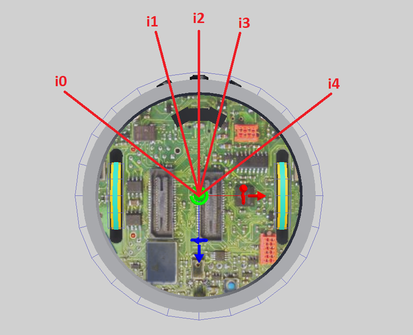

# Detección de obstáculos

Ahora que ya sabemos usar algunos sensores avanzados del robot es un buen momento para empezar a pensar en la detección de los obstáculos que puede haber en el mapa.

Recordemos que los obstáculos tienen las siguientes características:

1. Pueden tener cualquier forma, incluyendo rectangular, piramidal, esférica, o cilíndrica.
2. Pueden estar fijados al piso.
3. El color no está especificado.
4. Deben estar al menos a 8 cm de cualquier pared.


Sabiendo esto podemos imaginarnos múltiples opciones para detectarlos. Por un lado, podríamos usar múltiples sensores de distancia ubicados estratégicamente al frente del robot y tratar de determinar la presencia de un obstáculo mediante los valores que los sensores indiquen. Otra opción posible sería analizar la información provista por el LIDAR. En este ejemplo, iremos por la segunda alternativa. 

Es importante recordar que el LIDAR no es un sensor que se incluya en el robot por defecto, por lo que debemos agregarlo a nuestro robot haciendo una estructura personalizada. Y la ubicación y orientación del sensor son determinantes para la efectividad del programa. En este ejemplo usaremos la misma estructura de robot utilizada para los ejemplos de uso del LIDAR: [robot_lidar.json](04_Obstaculos/robot_lidar.json)

Asimismo, para hacer las pruebas necesitamos un mapa que incluya obstáculos por lo que utilizaremos el mundo [mapa_obstacles_1.wbt](04_Obstaculos/mapa_obstacles_1.wbt), que armamos especialmente para este propósito.


Dada la información que nos proporciona el LIDAR tenemos también múltiples posibilidades para la detección de obstáculos, algunas más sofisticadas que otras. Vamos a comenzar por la más sencilla: chequear un conjunto pequeño de puntos buscando un patrón determinado que nos indique la cercanía de un obstáculo.

La primera pregunta que nos hacemos es qué puntos verificar. Dependiendo de esta decisión el resultado será distinto, por lo que deberemos evaluar con cuidado para tratar de elegir la opción que mejor permita distinguir los obstáculos de las paredes. En este ejemplo hemos decidido chequear los siguientes puntos:



La siguiente cuestión a determinar es qué capas observar de la imagen de profundidad que nos devuelve el LIDAR. En nuestras pruebas hemos observado que la capa 0, al estar ubicada encima del robot, suele ser menos precisa que la capa 1. Por esta razón, decidimos utilizar la capa 1, que consideramos que incluye la información de mayor utilidad.

Vamos a comenzar por declarar una función que realizará todo el trabajo de la detección. Llamaremos a esta función “hasObstacle” y la misma servirá para indicar si la información del LIDAR incluye o no un obstáculo. Para ello, lo primero que haremos será calcular dónde se ubican en la lista de valores de profundidad que recibimos como parámetro. Esta lista representa la información de una sola capa del LIDAR (¡importante!) y está compuesta por todos los valores que se obtienen como resultado del escaneo del láser. Es importante recordar que, en el robot que utilizamos para las pruebas, el barrido comienza detrás del robot y continua en sentido horario, generando exactamente 512 valores a lo largo de la circunferencia completa del robot. Sabiendo todo esto podemos calcular fácilmente los índices donde se ubican los puntos que nos interesan.

```python
# Función que busca obstáculos en una capa del LIDAR
def hasObstacle(layer):
    # El LIDAR emite 512 rayos alrededor del robot, pero sólo nos interesan 
    # 5 puntos al frente del robot. Acá calculamos los índices de cada rayo 
    d = math.pi/16
    i0 = int((math.pi - d*4) / math.tau * 512)
    i1 = int((math.pi - d*1) / math.tau * 512)
    i2 = int((math.pi + d*0) / math.tau * 512)
    i3 = int((math.pi + d*1) / math.tau * 512)
    i4 = int((math.pi + d*4) / math.tau * 512)

    print(f"0: {layer[i0]:.3f}, 1: {layer[i1]:.3f}, 2: {layer[i2]:.3f}, 3: {layer[i3]:.3f}, 4: {layer[i4]:.3f}")

    # Umbrales para objetos cercanos y lejanos
    t_near = 0.06
    t_far = 0.2

    # Finalmente chequeamos que los rayos centrales (i1, i2, e i3) detecten
    # objeto cercano pero los extremos (i0 e i4) no detecten nada
    return (layer[i1] < t_near or layer[i2] < t_near or layer[i3] < t_near) \
        and (layer[i0] > t_far and layer[i4] > t_far)
```

Finalmente, en el loop principal, debemos obtener la imagen de profundidad que genera el LIDAR, extraer la capa 1 y luego llamar a la función “hasObstacle” pasando esta información como parámetro. Si la función devuelve True, entonces eso significa que el robot está frente a un obstáculo, en cuyo caso mostramos un mensaje en la consola.

```python
while robot.step(TIME_STEP) != -1:
    # Obtenemos la imagen de profundidad
    image = lidar.getRangeImage()

    # Extraemos de la imagen sólo los datos correspondientes a la capa 1
    layer_1 = image[512:1024]

    # Si detectamos un obstáculo mostramos un mensaje
    if hasObstacle(layer_1):
        print("OBSTÁCULO!")
    else:
        print("NO HAY OBSTÁCULO")
```

Dado que no hemos escrito código para mover el robot, para verificar el correcto funcionamiento del controlador deberemos mover manualmente el robot y ubicarlo en diferentes lugares del mapa. Cuando el robot se encuentre con un obstáculo adelante debería mostrar el mensaje “OBSTÁCULO!” en la consola.


[Descargar ejemplo completo](04_Obstaculos/ejemplo_1.py)

---
## Ejercicios

Para cada ejercicio se pide armar un programa controlador distinto y entregar los archivos de código.

1. Hacer un controlador que detecte obstáculos usando sensores de distancia
2. Hacer un controlador que pueda explorar el mapa [mapa_obstacles_1.wbt](04_Obstaculos/mapa_obstacles_1.wbt) sin chocar con obstáculos.

