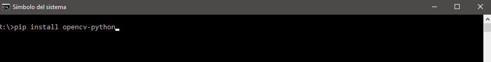
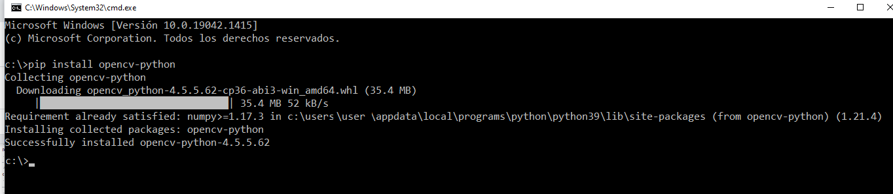
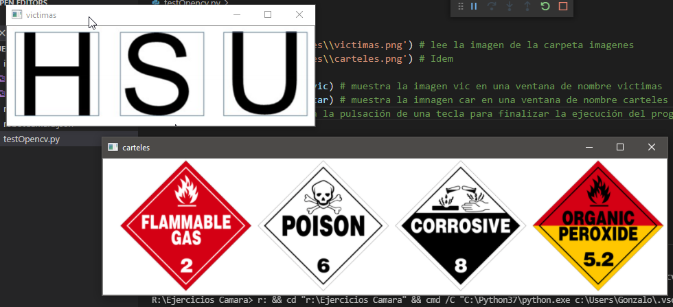
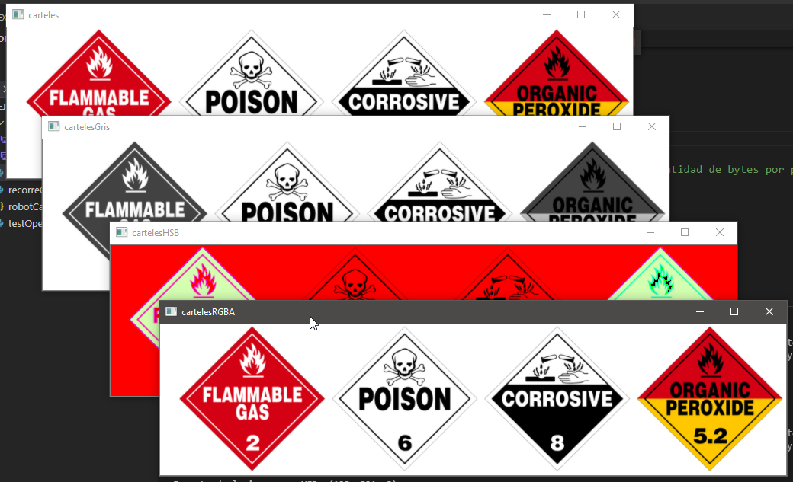
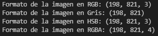

# 1. Instalación de OpenCV y conceptos básicos de imágenes

## Instalación de OpenCV

OpenCV es la librería más popular de procesamiento de imágenes. Es libre, abierta y gratuita, y tiene por detrás una inmensa comunidad que actualiza constantemente con los últimos avances algorítmicos que desarrolla la academia. A pesar de que muchos de los conceptos que presenta no son sencillos (deberíamos realizar un curso específico de procesamiento de imágenes), lo que vamos a necesitar para Rescue es recortado y fácil de comprender. Sin embargo, es una buena oportunidad para introducir a los estudiantes en una rama de la tecnología que está en auge. Muchísimos de los procedimientos de aprendizaje automático basado en imágenes utiliza OpenCV como herramienta de preprocesamiento antes de introducir los datos en redes neuronales. Por lo tanto, como dijimos al principio del curso, Rescue es una maravillosa puerta de entrada para tecnologías de última generación.

Para poder utilizar OpenCV, debemos instalar una librería en Python. Para ello, abrimos una ventana de símbolo de comando y ejecutamos

```bash
pip install opencv-python
```

como vemos en la imagen



Si no estaba instalada previamente, sumará a este proceso otra librería excelente llamada numpy.



Para comenzar a trabajar con los ejemplos de OpenCV, les solicitamos que bajen el siguiente archivo y lo descompriman en la carpeta que deseen. 

[EjerciciosCamara.zip](01_Instalacion/EjerciciosCamara.zip)

Una vez hecho esto, con la opción de VSC File/Open Folder… abrimos la carpeta Ejercicios Camara. Allí se encontrarán con un conjunto de archivos .py y carpetas con todo el material que utilizaremos en esa unidad.

Para probar que la instalación de OpenCV es correcta, vamos a abrir el programa [testOpencv.py](01_Instalacion/testOpencv.py).

```python	
import cv2

vic=cv2.imread('imagenes\\victimas.png') # lee la imagen de la carpeta imagenes
car=cv2.imread('imagenes\\carteles.png') # Idem

cv2.imshow('victimas',vic) # muestra la imagen vic en una ventana de nombre victimas
cv2.imshow('carteles',car) # muestra la imnagen car en una ventana de nombre carteles
cv2.waitKey(0) # espera la pulsación de una tecla para finalizar la ejecución del programa
```
Y lo ejecutamos con F5. Si todo está instalado correctamente, deben aparecer dos ventanas con imágenes de víctimas y carteles de Rescue, esperando la presión de una tecla para finalizar.



Si logran obtener estas ventanas (puede ser que aparezcan apiladas, las pueden mover como cualquier ventana), ¡ya tienen openCV funcionando!

## Conceptos básicos de imágenes

Una imagen no es más que un rectángulo de píxeles. Y cada pixel es un número que representa su aspecto. Este número va a depender del modelo de color utilizado para la imagen. Hay muchos modelos, pero los más populares son RGB (red, green, blue), RGBA (idem pero con un canal de transparencia, alfa), Grayscale (escala de grises) y HSV (hue, saturation, value - matiz, saturación, valor de brillo, también conocido como HSB).

Por ejemplo, en una imagen en RGB, cada píxel es una combinación de 3 bytes, donde cada byte representa un valor entre 0 y 255 para cada color. En RGBA tengo 4 bytes, ya que el cuarto representa la transparencia también con un valor entre 0 y 255. En el caso de escala de grises, cada píxel está representado por un valor entre 0 y 255.

Para ver estas representaciones, ejecutemos el programa [conceptoImagen.py](01_Instalacion\conceptoImagen.py). Podemos ver allí la salida de 4 conversiones distintas:



Cuando imprimimos su formato (shape) obtenemos en la ventana de la consola el alto, ancho y la cantidad de bytes por píxel.



llí podemos ver que en RGB y HSB tenemos 3 bytes por píxel. En el caso de escala de grises, no está indicado porque es sólo un byte por píxel. Y en RGBA, se suma un cuarto byte para la transparencia.


Y eso es todo: ¡una imagen no es más que un rectángulo de píxeles! Por lo tanto, podemos jugar con la imagen moviendo los píxeles de un lado para otro, cambiando el valor de algunos de sus bytes, etc. Para ver algunas de esas transformaciones, los invitamos a ejecutar el programa [ejemplosBasicos.py]((01_Instalacion\ejemplosBasicos.py)).