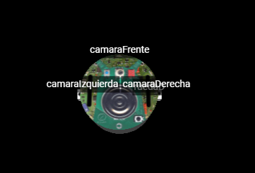

# 2. Activación de cámaras del robot y captura de imágenes

Es hora de ponernos a analizar las cámaras de nuestro robot. En primer lugar, el robot por defecto tiene las cámaras ubicadas de una forma no demasiado útil en nuestro caso:


camera_right y camera_left están apuntando en diagonal, y eso no nos va a resultar útil para ver los carteles que queden a nuestra izquierda o derecha. Por lo tanto, vamos a diseñar un robot nuevo (el que está como [robotParaEjerciciosCamaraIU.json](02_Captura\robotParaEjerciciosCamaraIU.json)) que tiene las cámaras al costado y apuntando en forma recta para cada lado:



En este caso las cámaras se llamaran camaraIzquierda (resolución 40x40), camaraFrente (resolución 128x128) y camaraDerecha (resolución 40x40).

Las ruedas son ruedaI y ruedaD.

También tenemos sensores de distancia para los costados y el frente:


Como podemos ver, se llaman distanciaIzquierda, distanciaFrente y distanciaDerecha.


A partir de ahora, vamos a utilizar el mundo **Camara.wbt**. Lo vamos a encontrar en la carpeta World de nuestro set de archivos. Recordar copiar el mundo dentro de game/worlds para que podamos abrirlo.

Ahora vamos a implementar un recorrido siguiendo la pared izquierda, pero con movimientos por baldosa. Podemos verlo en el archivo ContRecorrePorBaldosaIU.py. Si ejecutamos este controlador, podemos ver arriba del mundo, a la izquierda, un cuadro con lo que ve una de las cámaras (la imagen más grande es la de la cámara que está de frente).


Las demás cámaras también tienen su ventanita, más pequeñas. Si hacemos click y arrastramos cada ventana, podremos ver todas al mismo tiempo (En nuestro caso vamos a ver las ventanas de cámara izquierda y derecha más pequeñas).


Ahora bien, ponernos a realizar el procesamiento de imágen para detectar víctimas y carteles directamente sobre el simulador puede ser muy engorroso. Tenemos que cargar el controlador y el robot cada vez, no tenemos forma de ver claramente los procesos intermedios de la imagen, y otras dificultades. **Es por eso que vamos a utilizar nuestro programa para grabar las imágenes de las cámaras y luego procesarlas directamente desde VSC.** Una vez que desarrollemos la función que nos devuelve el tipo de cartel detectado, la incorporaremos en el código de nuestro robot.

Para obtener la imagen de la cámara, utilizaremos el método ***getImage()*** de cada una de ellas. El problema es que el formato que nos devuelve no sirve para grabarlo con openCV. Por lo tanto, debemos convertirlo a un array de numpy, de la siguiente manera:

```python
def convertirCamara(imagen, alto, ancho): #Convierte la imagen de la camara a una imagen de opencv
    return np.array(np.frombuffer(imagen, np.uint8).reshape((alto,ancho, 4)))
```

En esta función, pasamos la imagen capturada por ***getImage()*** y la devolvemos en el formato correcto para grabarla. Luego simplemente utilizamos el método de openCV ***cv2.imwrite(nombreDeArchivo, imagen)*** para almacenarlo.

```python
    cv2.imwrite(f"CI{str(nroImagen).rjust(4,'0')}.png",convertirCamara(camI.getImage(), 40,40))
    cv2.imwrite(f"CD{str(nroImagen).rjust(4,'0')}.png",convertirCamara(camD.getImage(),40,40))
    cv2.imwrite(f"CF{str(nroImagen).rjust(4,'0')}.png",convertirCamara(camF.getImage(),128,128))
```
Dado que el código cuando se carga se ejecuta desde la carpeta *game/controllers/robot0controller* dentro de nuestra instalación de Erebus, tenemos que buscar los archivos grabados de las cámaras allí.

Para poder grabar una secuencia de archivos, utilizamos una variable *nroImagen* que se incrementa, para poder tener archivos distintos. El método ***rjust(cantidad, caracter)*** simplemente agrega el caracter indicado hasta llevar la cadena a la longitud definida en cantidad.

Si ponemos a ejecutar el código [ContRecorreGrabandoIU.py](02_Captura\ContRecorreGrabandoIU.py) hasta recorrer todo el laberinto, nos encontraremos con muchos archivos de las cámaras en las carpetas indicadas. 


***Recomendamos mover los archivos de esa carpeta una vez capturados, porque si ejecutamos otra vez el controlador, va a grabar pisando los archivos anteriormente creados.***

