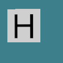
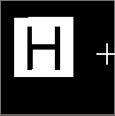
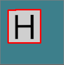

# 3. Detección e identificación de víctimas - Detectando el cartel

Dentro de *capturasSinOrdenar* en la carpeta *Ejercicios Camara*, podemos encontrar un conjunto de capturas ya almacenadas utilizando el algoritmo *ContRecorreGrabando.py*. Es fundamental que clasifiquen esa carpeta de la siguiente manera:

- Poner en una carpeta las imágenes que no tienen carteles.
- Poner en otra carpeta las imágenes que tienen carteles de víctimas.
- Poner en una última carpeta las imágenes que tienen carteles de peligro.

Como son muchas imágenes, pueden hacerse un subconjunto en una nueva carpeta de testeo, donde pongan un puñado de cada una, para ver cómo se comporta el procesamiento final.

Cuando veamos cómo crear mundos, está bueno que se armen los propios, con diferentes carteles, y que utilicen el algoritmo de recorrido para ir grabando otras imágenes. Lo mejor para testear es tener muchos casos distintos.

**TODO LO QUE PRESENTAREMOS DE AQUÍ EN ADELANTE, SON SÓLO SUGERENCIAS. Seguramente hay mejores formas de resolver la detección, y los alentamos a que, junto con sus estudiantes, prueben con diversos recursos de opencv que lo harán más rápido y con más precisión.**

El código que desarrollaremos a continuación está implementado en **deteccionVic01.py**.

Las imágenes que grabamos con la camara de frente son de 128x128, donde cada pixel combina los canales RGBA. 



En el caso de las víctimas el color no nos interesa, dado que siempre son letras negras (H, S o U) sobre un cartel blanco. Por lo tanto, podemos convertir esa imagen a un modelo de escala de grises, para acentuar las diferencias y trabajar con menos datos. Para ello tenemos que utilizar el método *cvtColor* de opencv.

```python
gris=cv2.cvtColor(imagen, cv2.COLOR_BGR2GRAY)
```
Donde pasamos como primer parámetro la imagen a convertir, y en el segundo caso el modelo de color al cual queremos llevarla. Este método nos devuelve la imagen en ese modelo. Por lo tanto, en *gris* tenemos *imagen*, pero convertida a escala de grises.


Aún convertida a grises, tengo un degradé bastante amplio (256 valores). Si quiero binarizar la imagen, es decir, convertirla a dos valores, uno para oscuro y otro para claro, podemos ejecutar el método *threshold* de opencv. Para ello, debo definir un umbral. Aquellos pixeles que están por debajo de ese umbral, se convertirán en 0 (negro), y aquellos que no, pasarán a tener un valor determinado que paso como parámetro. La sintaxis es así:

```python
ret, thresh=cv2.threshold(gris, 140, 255, cv2.THRESH_BINARY)
```

En el primer parámetro indicamos la imagen a convertir. En el segundo, el valor del umbral. El tercero es el valor al cual quiero llevar los pixeles que superen los 140. Y el último me indica el tipo de conversión. Como dijimos anteriormente, nuestra conversión es binaria.

Hay diferentes formas de realizar el threshold. Por ejemplo, para manejar diferencias de luz en la imagen, podríamos tener un umbral dinámico según el contexto de los pixeles. Nosotros no tenemos ese problema, con lo cual usamos un mecanismo de umbral simple. Es decir, para cada pixel se aplica el mismo umbral. 



Podemos ver como la imagen quedó completamente clara. El objetivo ahora es poder recortar el cartel, dejando de lado lo demás. De esta manera podremos detectar en forma sencilla la letra que representa. Para ello, vamos a pedirle a nuestro buen amigo opencv que detecte los contornos con la función *findContours*:

```python	
contornos, jerarquia = cv2.findContours(thresh, cv2.RETR_EXTERNAL, cv2.CHAIN_APPROX_SIMPLE)
```

Me devuelve dos valores: en primer lugar, una lista de contornos, donde cada contorno a su vez es una lista de puntitos. En segundo lugar obtenemos un árbol de jerarquías, donde podemos saber qué contorno se encuentra dentro de cuál otro, o cuáles están al mismo nivel. Como no lo usaremos, no nos detendremos en analizarlo.

Con respecto a los parámetros, en el primer caso indicamos la imagen a procesar. El segundo parámetro indica cómo se elabora la jerarquía de contornos (árbol, todos iguales, sólo dos niveles, etc). En nuestro caso, nos interesan sólo los contornos externos, dado que queremos reconocer el cartel. El último parámetro nos permite definir el grado de aproximación al contorno: ¿guardo todos los puntos o tomo sólo los más representativos? Aquí hemos elegido la segunda opción. De todos modos, invitamos a seguir investigando en el siguiente link: [Contornos y cómo dibujarlos en OpenCV](https://omes-va.com/contornos/).

Si una vez detectados, queremos dibujarlos sobre una imagen, utilizamos el siguiente método de openCV:

```python
cv2.drawContours(imagen, contornos, -1, (0, 0, 255), 2)
```

En el primer parámetro indico sobre qué imagen se dibujarán. El segundo define la variable que tiene la lista de los contornos a dibujar. En el tercero puede indicar qué contorno dibujar. Si pongo -1, expreso que quiero todos. El cuarto parámetro es una tupla de 3 valores con la cantidad de azul, de verde y de rojo que tendrá mi línea. Y por último indico el grosor de la línea en pixeles.



¡Ya lo tenemos en nuestras manos! ¡Traigan la tijera!

## ¡Ejercicio!

Ejercicio 1: hacer una función que dada una imagen me devuelva los contornos si considera que es un cartel, o None si considera que no.


