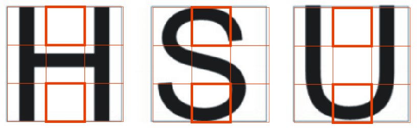

# 4. Detección e identificación de víctima - Identificando la letra

**El código que desarrollaremos a continuación está implementado en deteccionVic02.py**

 A esta altura ya hemos logrado esto:


Ahora queremos recortar el cartel de allí, para tenerlo aislado de lo demás, y luego analizarlo para identificar la letra correspondiente.

Antes que nada, ¿cómo hago en este punto para descartar imágenes que no tengan víctimas, que las tengan a medias, o haya otros elementos en el cartel?

En primer lugar, si el cartel está “limpio” como la imagen anterior, esperamos que el método *findcontours* (usando el parámetro que indica que sólo quiero los contornos externos) detecte sólo uno. Eso lo podemos verificar simplemente con *len(contornos)*.

Pero además, ese único contorno debe tener pocos puntos para ser un rectángulo. En el siguiente ejemplo tenemos un único contorno, pero la cantidad de puntos que lo forman es grande:


Para poder saber la cantidad de puntos de nuestro único contorno, basta con hacer *len(contornos[0])*.

En síntesis, si los contornos detectados pasan ambas condiciones (es uno sólo, y tiene pocos puntos) lo recortaremos y analizaremos la letra.

Para obtener el rectángulo donde está el cartel, vamos a usar el siguiente método:

```python
    approx=cv2.minAreaRect(contornos[0])
```

**minAreaRect** nos devuelve el rectángulo más chico que tenga dentro el contorno pasado como parámetro. De esta manera, aunque el contorno tenga varios puntos, obtenemos un rectángulo preciso. El método nos devuelve la siguiente tupla:


**( (x del centro, y del centro), (ancho, alto), ángulo del rectángulo)**


Por lo tanto, si el ángulo que obtuvimos es múltiplo de 90, vamos a recortar el cartel de la siguiente manera:

```python
        x=int(approx[0][0])
        y=int(approx[0][1])
        mitadAncho=int(approx[1][0]/2)
        mitadAlto=int(approx[1][1]/2)

        rect=thresh[y-mitadAlto:y+mitadAlto, x-mitadAncho:x+mitadAncho] 
```
Finalmente, en *rect* tendremos el cartel limpio, sin nada de lo que está a su alrededor.

*NOTA: Recordemos que vamos a tener que enviar el mensaje sólo cuando estemos suficientemente cerca del cartel. Para ello, una vez que lo recortamos, podemos medir su tamaño y de esa manera decidir si seguimos con la detección de la letra o directamente abortamos el proceso dado que estamos lejos (si se ve chico, es que estamos lejos)*


¿Qué nos queda hacer ahora? ¡Identificar la letra!

Podríamos utilizar algún sistema de reconocimiento de caracteres, pero son lentos, y están destinados a reconocer cualquier caracter de cualquier fuente. Por lo tanto, es una herramienta demasiado poderosa y costosa en tiempo de ejecución para lo que precisamos. Entonces, ¿de qué manera más sencilla podemos reconocer la letra?

De acá en adelante, los invitamos a experimentar. Tal vez una forma sería verificar la cantidad de puntos negros que tiene el cartel. ¿Existe una proporción distinta de puntos si es una S, una H o una U? Para obtener el tamaño del cartel, podemos usar la propiedad shape de la matriz:

```python
        tamanio=rect.shape[0]*rect.shape[1]
```

Luego, para contar los puntos negros, podemos usar el método count_nonzero. Este método cuenta los valores de la matriz que cumplan con la condición que paso de parámetro. En nuestro caso:

```python
        pixelesNegros=np.count_nonzero(rect==0)
```

Si luego calculamos *pixelesNegros/tamanio* podemos obtener el porcentaje de puntos negros con respecto al total del cartel. Pero, ¿esto distingue a las letras? Para saberlo, deberán probarlo con muchas S, H y U, e ir tomando nota de los valores que devuelve, para determinar si encuentran un patrón.

Otra forma sería buscar algunas partes del cartel que puedas ser más significativas según la letra que contengan. Por ejemplo:



Como podemos ver, si tomamos sólo esas dos partes del cartel, en el caso de la H, tenemos 0 puntos negros en ambas; en la S tenemos puntos negros en las dos; y en el caso de la U, sólo tenemos en el cuadro de abajo.

Para obtener los cuadritos, simplemente hacemos:

```python
        cuadritoArriba=thresh[y-mitadAlto:y-int(mitadAlto/3), x-int(mitadAncho/3):x+int(mitadAncho/3)]
        cuadritoAbajo=thresh[y+int(mitadAlto/3):y+mitadAlto, x-int(mitadAncho/3):x+int(mitadAncho/3)]
```

¡Y sólo nos queda contar los puntos negros en cada uno de ellos para saber qué letra es!

¡Recuerden que todo esto debe probarse y ajustarse a partir de muchísimas capturas de víctimas que graben en diferentes laberintos!

## ¡Ejercicios!
Ejercicio 2: hacer una función que dada una imagen, me devuelva el cartel recortado en thresh (blanco y negro) o None si no es un cartel.

Ejercicio 3: armar una función que dada una imagen me devuelva la letra si es un cartel, o None si no lo es.