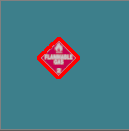
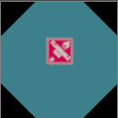

# 5. Detección e identificación de cartel - Detectando el cartel

**El código que desarrollaremos a continuación está implementado en deteccionCar01.py**

Comencemos ahora con los carteles de advertencia. Desde ya que todo lo que hicimos con las víctimas será de utilidad. Por lo tanto, nuestro primer paso será la extracción del cartel.


Los primeros pasos serán los mismos: obtener la escala de grises, el threshold, el contorno y el rectángulo donde está inscripto el cartel. 

```python
    gris=cv2.cvtColor(imagen, cv2.COLOR_BGR2GRAY)
    ret, thresh=cv2.threshold(gris, 140, 255, cv2.THRESH_BINARY)
    contornos, hierarchy = cv2.findContours(thresh, cv2.RETR_EXTERNAL, cv2.CHAIN_APPROX_SIMPLE)
    approx=cv2.minAreaRect(contornos[0])
    angulo=approx[2]
```



La única diferencia significativa, es que en este caso los carteles no son un rectángulo con la base paralela al piso, sino que están rotados 45 grados. Por lo tanto, si el ángulo en el que está el cartel es de 45 grados (lo que confirma que es un cartel de advertencia), lo rotaremos para obtener un rectángulo preciso con el contenido del mismo. Con este fin, utilizaremos dos métodos:

1. cv2.getRotationMatrix2D(centro, ángulo, escala): devuelve la matriz de rotación que usaremos más adelante. Debo pasar el punto centro de la imagen, el ángulo que quiero rotar (positivo=a favor de las agujas del reloj), y si quiero hacer una transformación de escala, el valor correspondiente (con 1 mantengo la misma escala)
Con la matriz obtenida ejecutamos el siguiente método:

2. cv2.warpAffine(imagen, matriz de rotación, tamaño de salida): rota la imagen pasada como parámetro, usando la matriz de rotación, y escalando al tamaño de salida indicado.

```python
        alto, ancho=thresh.shape[0], thresh.shape[1]
        M=cv2.getRotationMatrix2D((ancho/2,alto/2),angulo,1)

        thresh_rot=cv2.warpAffine(thresh,M,(ancho,alto))
        imagen_rot=cv2.warpAffine(imagen,M,(ancho,alto))
```

En nuestro caso, aplicamos la rotación a *thresh* (obteniendo *thresh_rot*) para poder buscar el contorno nuevamente; y a *imagen* (obteniendo *imagen_rot*) para poder recortar luego el cartel de allí **porque lo necesitamos en colores para distinguir el tipo de advertencia.**

 

Por lo tanto, a partir de allí volvemos a buscar los contornos, pero ahora sobre thresh_rot y terminamos recortando el cartel.


## ¡Ejercicios!

Ejercicio 4: realizar una función que dada la imagen de la cámara, me devuelva None si no es un cartel, o el cartel ya rotado y limpio de contexto.

