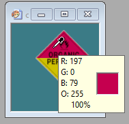
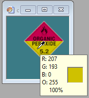
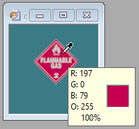
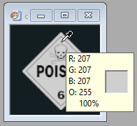
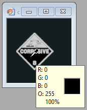
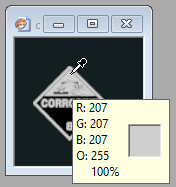

# 6. Detección e identificación de cartel - Identificando el cartel

**El código que desarrollaremos a continuación está implementado en deteccionCar02.py**

Con el cartel limpio, sólo nos falta reconocer el tipo de cartel. Para ello, vamos a hacer algo muy sencillo, dado que la imagen es pequeña. Recorreremos pixel por pixel, obteniendo su valor de azul (b), verde (g) y rojo (r) de la siguiente manera:

```python
b, g, r=rect[x,y]
```
Según los valores que obtengamos allí, iremos contando pixeles negros, blancos, amarillos y rojos. Pero ¿qué valores debe tener para estar dentro de uno de estos cuatro colores? Para saberlo, tenemos que usar alguna herramienta donde podamos estudiar la imagen, de manera tal que nos permita saber el valor de BGR de un pixel determinado de nuestros carteles. Todos los editores de imágenes lo tienen. Mostramos aquí algunos ejemplos de Paint Shop Pro:





Es importante que se detengan a probar en muchas imágenes, y en muchos sectores de la imagen. Algo muy importante a tener en cuenta es que los bordes de los colores no son abruptos, con lo cual tenemos zonas donde el valor puede ser algo intermedio.

En nuestro caso, a partir de las muestras que tomamos, definimos estos valores:


Color: B, G, R

Rojo: 79,0, 197

Amarillo: 0, 193, 207

Blanco: 207, 207, 207

Negro: 0, 0, 0 


Con estos valores, y jugando con cierto umbral para no dejar afuera los pixeles de colores intermedios, tenemos:

```python
        amarillo=0
        rojo=0
        negro=0
        blanco=0
        for x in range(rect.shape[0]):
            for y in range(rect.shape[1]):
                b, g, r=rect[x,y]
                if b>150 and g>150 and r>150:
                    blanco+=1
                elif b<50 and g<50 and r<50:
                    negro+=1
                elif b>70 and g<10 and r>180:
                    rojo+=1
                elif b<10 and g>180 and r>190:
                    amarillo+=1
```

Luego, a partir de los valores que obtengamos en estas cuatro variables, podremos definir qué tipo de cartel es cada uno.

## ¡Ejercicios!

Ejercicio 5:

Realizar una función que dada la captura de un cartel, me devuelva None o la letra F (Flammable), P (Poison), C (Corrosive) o O (Organic Peroxide)


**Ejercicio final**

Realizar una función que dada la captura de una imagen, me devuelva None si no es víctima o cartel, o está muy lejos de él, o la letra correspondiente al cartel o víctima.

